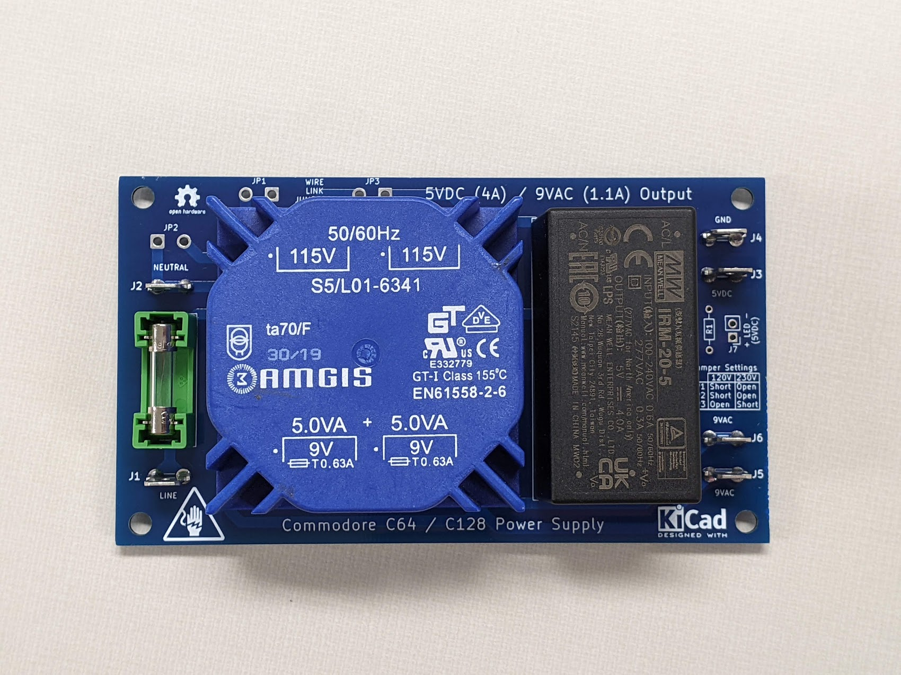

# C64/C128 Power Supply
This power supply is a simple design for the C64 or C128.

## Assembly
* Order the PCB from your choice of PCB fab. (JLCPCB, PCBway, OSH Park, etc.)
* Order the parts necessary as listed in the BOM. (The transformer can be substituted with a Talema 70041k if you can't find the Amgis)
* Solder the fuse holder, spade connectors, resistor, and pin header. Alternatively, an LED can be fit directly in place of the pin header.
* Solder the Meanwell 5V power supply and the transformer.
* Observe the jumper settings on the board near the 5V power LED. For 120V outlets, JP1 and JP2 require a wire link jumper. For 230V outlets, JP3 requires a wire link jumper.
* Grab a spare NEMA 1-15 or 5-15 cable and cut the female end off, stripping the wire insulation. Spare the ground cable if using a NEMA 5-15, as it isn't used. As for countries outside of North America, use an appropriate quality cable that matches your outlet.
* Install female spade connector fittings on your power plug wires that match the size of the male fittings on the PCB. They're found at any auto store.
* For the Commodore side of the connector, you can make your own cable with a 7-pin DIN, or cut the end off an old failed power supply. Follow the Commodore spec for your connections, using a multimeter for confirmation, as the wire colors may not always be correct.
* I don't have a case for this yet, but you can put it in a project box, mounted using the 4 holes provided on the PCB. If you're really inclined, make a 3D printed enclosure and please share files with the community. 
* Connect the power cables, insert the fuse, and start using it.

## Project Status
This power supply has been tested and confirmed working by numerous people. No issues have been reported.

## Other
This is an open source project. Feel free to do what you want with it.
